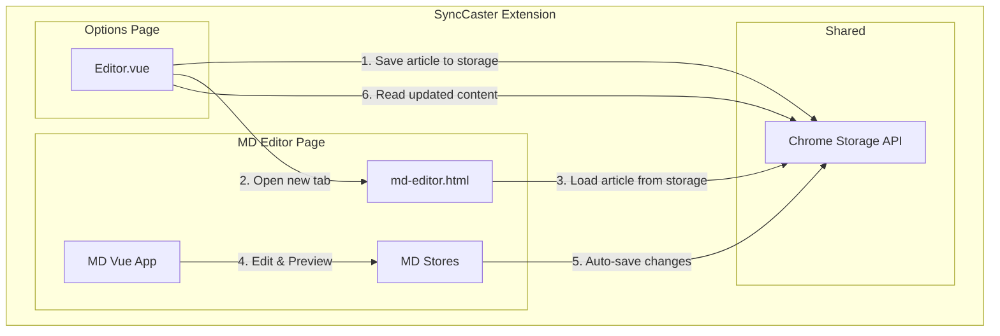

# Design Document: MD Editor Integration

## Overview

本设计将 doocs/md 项目（微信 Markdown 编辑器）完整集成到 SyncCaster 浏览器扩展中。采用"独立页面集成"方案，将 md 项目构建为扩展的一个独立 HTML 页面（md-editor.html），通过 Chrome Storage API 实现与主编辑器（Editor.vue）的数据传递。

### 核心设计目标

1. **完整功能保留**: 保留 md 项目的所有功能（主题切换、字体调整、代码块样式、数学公式等）
2. **无缝数据传递**: 通过 Chrome Storage API 在 Editor.vue 和 md-editor 之间同步文章内容
3. **离线可用**: 所有资源本地化，无需网络即可使用
4. **构建集成**: 将 md 项目的构建流程集成到扩展的构建流程中

## Architecture



### 数据流

1. 用户在 Editor.vue 点击"公众号预览"按钮
2. Editor.vue 将当前文章（ID、标题、Markdown 内容）保存到 Chrome Storage
3. 打开新标签页加载 md-editor.html
4. md-editor 从 Chrome Storage 读取文章内容并加载到编辑器
5. 用户在 md-editor 中编辑、预览、复制格式化后的 HTML
6. 用户关闭 md-editor 或点击"返回"时，内容自动保存到 Chrome Storage
7. Editor.vue 重新加载时从 Chrome Storage 读取更新后的内容

## Components and Interfaces

### 1. Chrome Storage Data Interface

```typescript
// 存储在 Chrome Storage 中的文章数据结构
interface SyncCasterArticle {
  id: string;           // 文章 ID
  title: string;        // 文章标题
  content: string;      // Markdown 内容
  sourceUrl?: string;   // 采集来源 URL
  updatedAt: number;    // 最后更新时间戳
}

// Chrome Storage Key
const STORAGE_KEY = 'synccaster_current_article';
```

### 2. Storage Bridge Module

```typescript
// packages/core/src/storage/chrome-storage-bridge.ts

/**
 * Chrome Storage 桥接模块
 * 用于在扩展的不同页面间传递文章数据
 */
export class ChromeStorageBridge {
  private static STORAGE_KEY = 'synccaster_current_article';

  /**
   * 保存文章到 Chrome Storage
   */
  static async saveArticle(article: SyncCasterArticle): Promise<void>;

  /**
   * 从 Chrome Storage 读取文章
   */
  static async loadArticle(): Promise<SyncCasterArticle | null>;

  /**
   * 清除存储的文章
   */
  static async clearArticle(): Promise<void>;

  /**
   * 监听文章变化
   */
  static onArticleChange(callback: (article: SyncCasterArticle | null) => void): void;
}
```

### 3. MD Editor Adapter

```typescript
// md/apps/web/src/utils/synccaster-adapter.ts

/**
 * SyncCaster 适配器
 * 用于 md-editor 与 SyncCaster 扩展的集成
 */
export class SyncCasterAdapter {
  /**
   * 检测是否在 SyncCaster 扩展环境中运行
   */
  static isInExtension(): boolean;

  /**
   * 从 Chrome Storage 加载文章内容
   */
  static async loadFromExtension(): Promise<{ title: string; content: string } | null>;

  /**
   * 保存内容到 Chrome Storage
   */
  static async saveToExtension(title: string, content: string): Promise<void>;

  /**
   * 返回 SyncCaster 编辑器
   */
  static navigateBack(): void;
}
```

### 4. Build Integration

```typescript
// apps/extension/scripts/build-md-editor.ts

/**
 * MD Editor 构建脚本
 * 将 md 项目构建并集成到扩展中
 */
export async function buildMdEditor(): Promise<void> {
  // 1. 构建 md 项目
  // 2. 复制构建产物到 apps/extension/public/md-editor/
  // 3. 修改 index.html 为 md-editor.html
  // 4. 更新资源路径为相对路径
}
```

## Data Models

### SyncCasterArticle

| Field | Type | Description |
|-------|------|-------------|
| id | string | 文章唯一标识符 |
| title | string | 文章标题 |
| content | string | Markdown 格式的文章内容 |
| sourceUrl | string? | 文章采集来源 URL（可选） |
| updatedAt | number | 最后更新时间戳（毫秒） |

### MD Editor State

md-editor 内部使用 md 项目原有的 Post 数据结构，通过适配器与 SyncCasterArticle 进行转换。

## Correctness Properties

*A property is a characteristic or behavior that should hold true across all valid executions of a system-essentially, a formal statement about what the system should do. Properties serve as the bridge between human-readable specifications and machine-verifiable correctness guarantees.*

### Property 1: Storage Round-Trip Consistency

*For any* valid article with non-empty ID, title, and content, saving to Chrome Storage and then reading back should return an article with equivalent ID, title, and content values.

**Validates: Requirements 2.1, 2.2, 2.4**

### Property 2: Content Preservation on Navigation

*For any* article content modified in md-editor, when the user navigates back to Editor.vue, the Editor.vue should display the same content that was last saved in md-editor.

**Validates: Requirements 2.4, 6.2**

### Property 3: Build Output Completeness

*For any* successful build of the extension, the output directory should contain md-editor.html and all JavaScript/CSS assets required for the md-editor to function.

**Validates: Requirements 4.1, 4.2, 5.1**

## Error Handling

### Storage Errors

| Error | Handling |
|-------|----------|
| Chrome Storage quota exceeded | 显示错误提示，建议用户清理旧数据 |
| Storage read failure | 使用默认空内容，显示警告 |
| Storage write failure | 重试 3 次，失败后提示用户手动复制内容 |

### Navigation Errors

| Error | Handling |
|-------|----------|
| Tab creation failure | 显示错误提示，提供手动打开链接 |
| Extension context invalid | 检测环境，降级为普通网页模式 |

### Copy Errors

| Error | Handling |
|-------|----------|
| Clipboard API not available | 使用 DOM Selection 降级方案 |
| DOM Selection failure | 提示用户手动选择复制 |

## Testing Strategy

### Dual Testing Approach

本功能采用单元测试和属性测试相结合的方式：

- **单元测试**: 验证具体的边界情况和错误处理
- **属性测试**: 验证数据传递的一致性和完整性

### Property-Based Testing

使用 **fast-check** 库进行属性测试。

#### Test Configuration

```typescript
import fc from 'fast-check';

// 每个属性测试运行至少 100 次迭代
const testConfig = { numRuns: 100 };
```

#### Property Test: Storage Round-Trip

```typescript
/**
 * Feature: md-editor-integration, Property 1: Storage Round-Trip Consistency
 * Validates: Requirements 2.1, 2.2, 2.4
 */
test('storage round-trip preserves article data', async () => {
  await fc.assert(
    fc.asyncProperty(
      fc.record({
        id: fc.uuid(),
        title: fc.string({ minLength: 1, maxLength: 200 }),
        content: fc.string({ minLength: 0, maxLength: 50000 }),
        updatedAt: fc.integer({ min: 0 }),
      }),
      async (article) => {
        await ChromeStorageBridge.saveArticle(article);
        const loaded = await ChromeStorageBridge.loadArticle();
        
        expect(loaded).not.toBeNull();
        expect(loaded!.id).toBe(article.id);
        expect(loaded!.title).toBe(article.title);
        expect(loaded!.content).toBe(article.content);
      }
    ),
    testConfig
  );
});
```

### Unit Tests

#### Editor.vue Tests

- 点击"公众号预览"按钮调用正确的存储和导航函数
- 文章数据正确保存到 Chrome Storage
- 页面加载时正确读取 Chrome Storage 中的更新

#### MD Editor Adapter Tests

- 正确检测扩展环境
- 正确加载和保存文章数据
- 返回导航正确工作

#### Build Tests

- 构建输出包含所有必需文件
- 资源路径正确配置
- md-editor.html 可以独立加载

### Integration Tests

- 完整的用户流程测试：Editor.vue → md-editor → 复制 → 返回
- 离线模式功能测试
- 多标签页同步测试
