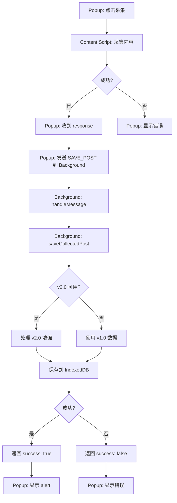

# 采集问题调试指南

## 问题描述

用户报告：点击采集文章后，Popup Console 显示采集成功，但没有任何反馈信息（alert 或通知）。

## 已修复的问题

1. ✅ **v2.0 处理器动态加载** - 避免阻塞 background 启动
2. ✅ **详细错误日志** - 添加了更多日志便于调试
3. ✅ **TypeScript 类型修复** - 修复了 onProgress 的类型错误
4. ✅ **代码分离** - v2.0 处理器现在是独立的 chunk

## 测试步骤

### 1. 刷新扩展

```
1. 打开 chrome://extensions
2. 找到 SyncCaster
3. 点击「刷新」按钮 🔄
```

### 2. 打开 Background Console

```
1. chrome://extensions
2. SyncCaster → Service Worker → 点击「检查视图」
3. 查看 Console 输出
```

### 3. 测试采集

```
1. 打开任意文章页面（例如 CSDN、掘金）
2. 点击 SyncCaster 图标
3. 点击「采集当前页面」
4. 观察两个 Console 的输出
```

## 预期日志

### Popup Console (正常)

```javascript
Collected content: {success: true, data: {...}}
// 然后应该显示 alert: "内容采集并保存成功！"
```

### Background Console (正常)

```javascript
[background] startup: Background service worker started
[background] v2: v2.0 processor loaded successfully  // 或者警告信息

// 采集时：
[background] message: Received message: SAVE_POST
[background] save: Saving post { title: "..." }
[background] v2: Processing content with v2.0 pipeline  // 如果 v2.0 可用
[background] v2-progress: parsing: 20%
[background] v2-progress: converting: 40%
[background] v2-progress: adapting: 80%
[background] v2-progress: complete: 100%
[background] v2: v2.0 processing successful { imageCount: X, formulaCount: Y, platforms: 4 }
[background] db: Post saved { id: "...", version: 2, v2Enhanced: true }
[background] save: Save result { success: true, postId: "...", v2Enhanced: true }
```

### Background Console (v2.0 不可用但正常降级)

```javascript
[background] v2: v2.0 processor not loaded, using v1.0
[background] db: Post saved { id: "...", version: 1, v2Enhanced: false }
[background] save: Save result { success: true, postId: "..." }
```

## 常见问题排查

### 问题 1: 没有 alert 弹出

**可能原因**:
- `chrome.runtime.sendMessage` 返回的 `saveResult` 是 undefined 或出错
- Background 没有响应 SAVE_POST 消息

**排查**:

在 Popup Console 中手动测试：

```javascript
// 测试消息通信
const result = await chrome.runtime.sendMessage({
  type: 'SAVE_POST',
  data: {
    title: 'Test',
    url: 'https://test.com',
    body_md: '# Test',
    body_html: '<h1>Test</h1>',
    summary: 'Test',
  },
});

console.log('Save result:', result);
// 应该输出: { success: true, postId: "...", v2Enhanced: false/true }
```

如果返回 undefined，说明 background 消息处理有问题。

### 问题 2: Background 抛出错误

**查看 Background Console**，寻找错误日志：

```javascript
[background] save: Save failed { error: "..." }
// 或
[background] v2: v2.0 processing failed, falling back to v1.0 { error: "..." }
```

**常见错误**:
1. **导入失败** - v2.0 模块导入失败
   ```
   [background] v2: Failed to load v2.0 processor, will use v1.0 only
   ```
   
2. **数据库错误** - IndexedDB 写入失败
   ```
   [background] db: Save post failed { error: "..." }
   ```

3. **unified 解析错误** - AST 转换失败
   ```
   [background] v2: v2.0 processing failed, falling back to v1.0
   ```

### 问题 3: v2.0 处理器加载失败

**症状**: Background Console 显示

```javascript
[background] v2: Failed to load v2.0 processor, will use v1.0 only
```

**原因**: 
- `content-processor-v2.ts` 中的依赖加载失败
- `@synccaster/core` 的 unified 相关模块有问题

**解决**: 
这不影响基本功能，v1.0 仍然工作。v2.0 是增强功能。

### 问题 4: Popup 没有收到响应

**排查步骤**:

1. 在 Popup Console 添加调试：

```javascript
// apps/extension/src/ui/popup/App.vue 的 collectFromCurrentPage 函数

const saveResult = await chrome.runtime.sendMessage({
  type: 'SAVE_POST',
  data: response.data,
});

console.log('saveResult received:', saveResult);  // 添加这行

if (!saveResult?.success) {
  console.error('Save failed:', saveResult);  // 添加这行
  throw new Error(saveResult?.error || '保存失败');
}
```

2. 检查 `chrome.runtime.lastError`:

```javascript
chrome.runtime.sendMessage(
  { type: 'SAVE_POST', data: response.data },
  (result) => {
    if (chrome.runtime.lastError) {
      console.error('Runtime error:', chrome.runtime.lastError);
    }
    console.log('Result:', result);
  }
);
```

## 手动测试保存功能

在 Options Console 中直接测试：

```javascript
const { db } = await import('@synccaster/core');

// 创建测试文章
const testPost = {
  id: 'test-' + Date.now(),
  version: 1,
  title: '测试文章',
  summary: '这是一个测试',
  canonicalUrl: 'https://test.com',
  createdAt: Date.now(),
  updatedAt: Date.now(),
  body_md: '# 测试\n\n这是测试内容',
  tags: [],
  categories: [],
  assets: [],
  meta: {
    source_url: 'https://test.com',
    collected_at: new Date().toISOString(),
  },
};

// 尝试保存
try {
  await db.posts.add(testPost);
  console.log('✅ 保存成功');
  
  // 查询
  const saved = await db.posts.get(testPost.id);
  console.log('查询结果:', saved);
} catch (error) {
  console.error('❌ 保存失败:', error);
}
```

## 临时解决方案

如果 v2.0 导致问题，可以完全禁用它：

```typescript
// apps/extension/src/background/index.ts

// 注释掉这部分
/*
let processCollectedHTML: any = null;
try {
  import('./content-processor-v2').then((module) => {
    processCollectedHTML = module.processCollectedHTML;
    logger.info('v2', 'v2.0 processor loaded successfully');
  }).catch((error) => {
    logger.warn('v2', 'Failed to load v2.0 processor, will use v1.0 only', { error: error.message });
  });
} catch (error: any) {
  logger.warn('v2', 'v2.0 processor import failed', { error: error.message });
}
*/

// 或者直接设置为 null
const processCollectedHTML = null;
```

然后重新构建：

```bash
cd apps/extension
pnpm build
```

这样会完全使用 v1.0，功能应该恢复正常。

## 检查 Service Worker 状态

Service Worker 可能会休眠，导致状态丢失：

```javascript
// Background Console
console.log('processCollectedHTML:', typeof processCollectedHTML);
// 应该输出 'function' 或 'null'
```

如果是 'null'，说明 Service Worker 重启后丢失了状态。解决方法是在每次消息处理时重新检查。

## 完整的采集流程检查



检查每个步骤的输出，找出哪里断了。

## 恢复建议

1. **刷新扩展** - 确保使用最新版本
2. **查看 Background Console** - 查找错误信息
3. **禁用 v2.0** - 如果问题持续，暂时禁用 v2.0
4. **清空数据** - 尝试清空 IndexedDB（慎用）

```javascript
// Options Console - 清空所有文章（谨慎！）
const { db } = await import('@synccaster/core');
await db.posts.clear();
console.log('All posts deleted');
```

5. **重启浏览器** - 有时 Service Worker 需要完全重启

## 联系开发者

如果问题持续，请提供：
1. Background Console 的完整日志
2. Popup Console 的输出
3. 采集的文章 URL
4. Chrome 版本信息

这将帮助快速定位问题。
